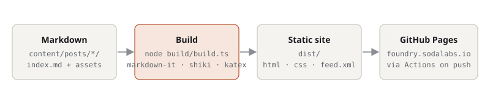

This is the first post on Foundry, so it doubles as a tour of the machinery behind it. Everything you see here is produced by a short TypeScript build script that reads a folder of Markdown files and writes static HTML. No framework, no runtime, nothing to log in to.

## Why build it rather than pick one

There are excellent static-site generators. I didn't use one because the thing I actually want is tiny: a loop over Markdown files, a template, and a deploy. Owning that loop means every behaviour on this site is a few lines I can read in one sitting, and there is nothing to upgrade when the ecosystem moves on. The genuinely hard parts (parsing Markdown, highlighting code, typesetting maths) are delegated to boring, stable libraries.



## What a post can contain

Each post is a folder with an `index.md` and whatever assets it needs beside it. Images, data files and demos are copied through verbatim, so relative links just work.

### Code

Fenced blocks are highlighted at build time with [shiki](https://shiki.style), using the same grammars as VS Code. Both light and dark colours are emitted, and CSS picks one based on the system theme, so there is no flash and no JavaScript. An optional label after the language names the file:

```ts build/build.ts
for (const post of posts) {
  const rendered = await renderer.render(post.markdown);
  await writeFile(path.join('posts', post.slug, 'index.html'), postPage(post, rendered, tagSlugs));
  await copyDir(post.sourceDir, path.join(paths.dist, 'posts', post.slug), (src) => {
    const name = path.basename(src);
    return name !== 'index.md' && !name.startsWith('.');
  });
}
```

Shell, Python, Rust, YAML and a couple of hundred other languages are available; anything unrecognised falls back to plain text rather than failing the build.

```sh
npm run new -- "Title of the next post"
npm run dev
```

### Maths

Inline maths like $\mathcal{O}(n \log n)$ and display maths are rendered to HTML with KaTeX at build time, so the page needs only a stylesheet:

$$
H(X) = -\sum_{i=1}^{n} p(x_i) \log_2 p(x_i)
$$

The KaTeX stylesheet is only included on pages that actually contain maths.

### Figures, tables and asides

A paragraph containing nothing but an image becomes a `<figure>` with the alt text as the caption, which is what happened to the diagram above. Tables are plain GitHub-flavoured Markdown:

| Field | Required | Purpose |
|---|---|---|
| `title` | yes | Shown everywhere |
| `date` | yes | Ordering and the feed |
| `summary` | yes | Post list, feed, link previews |
| `tags` | no | Grouping; tag pages are generated |
| `draft` | no | Hidden from production builds |
| `updated` | no | Shown alongside the publish date |
| `image` | no | Social card image for link previews |

> Blockquotes work for asides and pulled quotes. Footnotes work too, for the things that don't belong in the main thread.[^footnote]

[^footnote]: Like this. Footnotes are collected at the end of the post with back-links.

### Interactive demos

Write-ups about simulations or visualisations want something you can poke at. The convention here is deliberately low-tech: a self-contained `index.html` in the post folder, embedded with an `<iframe>`. It can use any library it likes and can't interfere with the rest of the page.

<iframe class="demo" src="demo/index.html" title="Phyllotaxis demo" height="360" loading="lazy"></iframe>

That one is a phyllotaxis spiral: point $k$ sits at radius $\sqrt{k}$ and angle $k \cdot 137.5^\circ$. Drag the slider to change the divergence angle and watch the pattern collapse into spokes whenever the angle approaches a rational fraction of a turn.

## How publishing works

A post lives in `content/posts/<date>-<slug>/index.md`. Running `npm run dev` serves the site locally with drafts visible and reloads the browser on every save. When a post is ready, flip `draft: false` and push to `main`; a GitHub Actions workflow builds the site and deploys it to GitHub Pages. There is no other step.

The feed is at [/feed.xml](/feed.xml). Expect posts to be infrequent and long.
